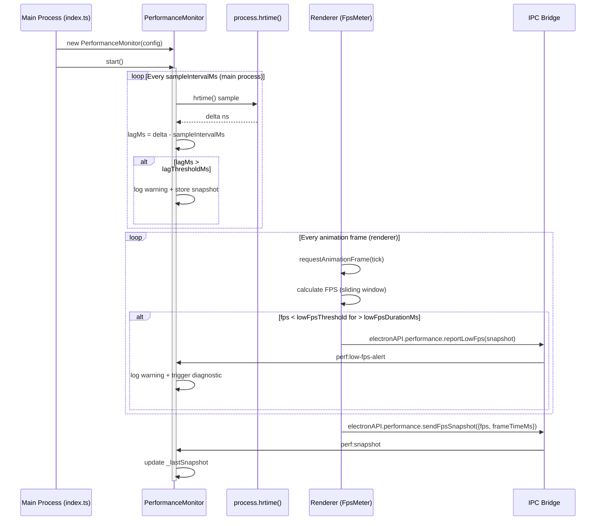
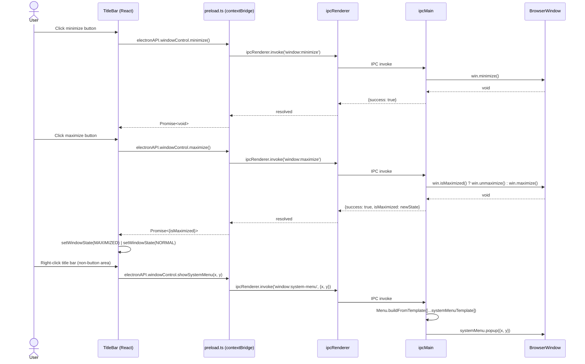
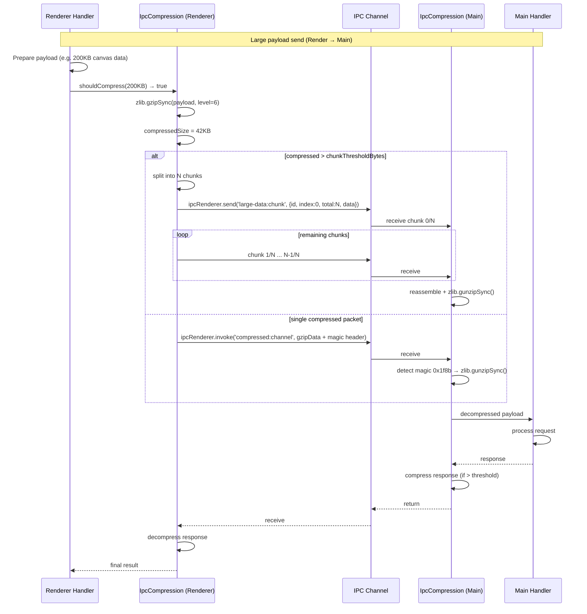
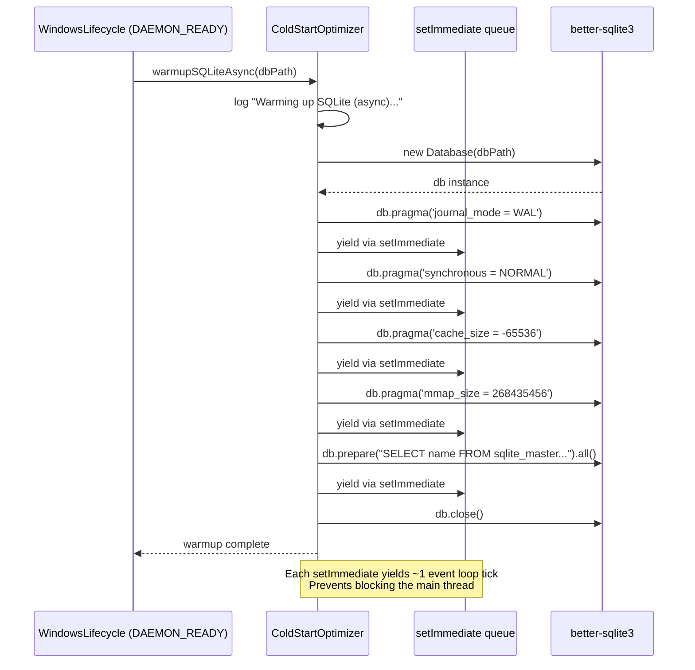
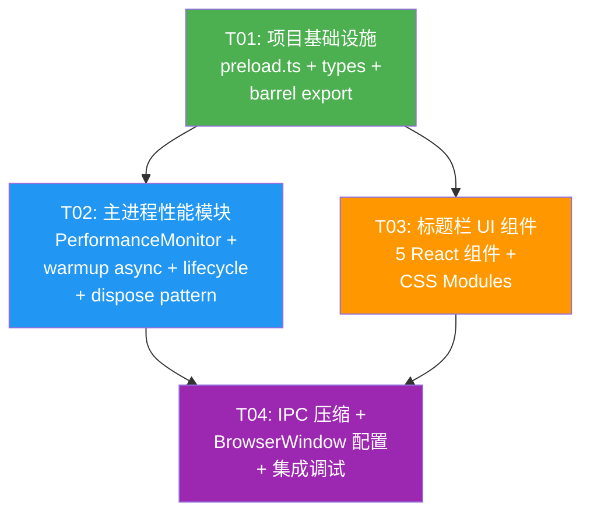

# Open Design Windows 客户端 — 增量架构设计

> **作者**: Bob (Architect)
> **日期**: 2025-06-24
> **版本**: v1.0
> **类型**: 增量架构设计（基于 v1.0 已有优化模块）
> **上游**: [增量 PRD](./incremental-prd-win-perf-titlebar.md)

---

## Part A: System Design

### 1. Implementation Approach

#### 1.1 核心挑战

| 挑战 | 说明 | 选型决策 |
|------|------|---------|
| **FPS 监测跨进程** | FPS 在渲染进程采集，Event Loop Lag 在主进程采集，需要统一接口对上报 | 主进程 `PerformanceMonitor` 类统一聚合；渲染进程 FPS 数据通过 IPC `perf:snapshot` 通道上报 |
| **warmupSQLite 真异步** | 当前 `async/await` 但内部 `better-sqlite3` 是同步 C++ addon，阻塞事件循环 | 改为 `setImmediate` 分片 + `synchronous=OFF` 先写再改回，避免 Worker Threads 引入序列化开销 |
| **IPC 压缩透明化** | 压缩/分块应不侵入现有 IPC handler 业务逻辑 | 装饰器模式：在 `ipcMain.handle()` 注册时包裹 compress/decompress 中间件 |
| **`frame: false` 的 DWM 阴影** | Windows 10 上移除系统标题栏可能丢失窗口阴影 | Electron ≥33 保留 DWM 阴影；Win10 降级时手动 CSS `box-shadow` patch |
| **preload 脚本新增** | 当前代码库无 preload.ts；标题栏/性能需要 contextBridge API | 新建 `apps/packaged/src/preload.ts`，遵循 Electron 安全最佳实践 |

#### 1.2 框架与库选择

| 用途 | 选择 | 理由 |
|------|------|------|
| **FPS 测量** | `requestAnimationFrame` (内置) | 零依赖，浏览器原生 API，精度 1 frame |
| **Event Loop Lag** | `process.hrtime()` + `setInterval` | Node.js 内置，无需额外包 |
| **IPC 压缩** | Node.js `zlib.gzipSync` / `zlib.gunzipSync` | 内置，gzip level 6 在 64KB+ 有效 |
| **压缩检测** | 魔数 `0x1f8b` (gzip 头) | 简单可靠，无需元数据 |
| **标题栏图标** | 内联 SVG (`currentColor`) | 零依赖，支持 dark/light 自动适配 |
| **Win11 检测** | `os.version()` + `process.platform` | Node.js 内置 |
| **Mica 材质** | `BrowserWindow.setBackgroundMaterial('mica')` | Electron ≥22 原生 API；feature-detect 降级 |

#### 1.3 架构模式

**主进程**：延续现有模块化模式（类 + setter 注入 + lifecycle hooks），新增模块遵循同模式。

**渲染进程**：React 函数组件 + CSS Modules，标题栏组件通过 React context 共享 `WindowState`。

**进程间通信**：

```
┌─────────────────────────┐        IPC (contextBridge)       ┌─────────────────────────┐
│    Renderer Process     │ ◄──────────────────────────────► │     Main Process         │
│                         │                                  │                          │
│  TitleBar (React)       │── windowControl.min/max/close ──►│  BrowserWindow API       │
│  FpsMeter (raf loop)    │── perf:snapshot ────────────────►│  PerformanceMonitor      │
│  IpcDecompress (zlib)   │◄── ipc-compressed-response ──────│  IpcCompression          │
└─────────────────────────┘                                  └─────────────────────────┘
```

---

### 2. File List

#### 2.1 新建文件

| # | 相对路径 | 用途 | 所属模块 |
|---|---------|------|---------|
| 1 | `apps/packaged/src/preload.ts` | contextBridge 暴露 `window.electronAPI` (窗口控制 + 性能) | 基础设施 |
| 2 | `apps/packaged/src/performance-monitor.ts` | FPS 聚合 + Event Loop Lag 采样 + 阈值告警 | 性能 |
| 3 | `apps/packaged/src/ipc-compression.ts` | IPC payload 自动 gzip 压缩/分块中间件 | IPC |
| 4 | `apps/packaged/src/types/performance-metrics.ts` | PerformanceSnapshot, FpsConfig, EventLoopLagConfig 类型 | 类型 |
| 5 | `apps/web/components/title-bar/title-bar.tsx` | 标题栏容器组件；管理窗口状态 (normal/maximized/focused) | 标题栏 |
| 6 | `apps/web/components/title-bar/title-bar-controls.tsx` | 窗口控制按钮组 (─ □ ✕) | 标题栏 |
| 7 | `apps/web/components/title-bar/title-bar-button.tsx` | 单个控制按钮 (min/max/close)，hover/active 视觉 | 标题栏 |
| 8 | `apps/web/components/title-bar/title-bar-icon.tsx` | 应用图标 + 右键菜单触发器 | 标题栏 |
| 9 | `apps/web/components/title-bar/title-bar-title.tsx` | 窗口标题文本 + 可选 customSlot | 标题栏 |
| 10 | `apps/web/components/title-bar/index.ts` | 标题栏组件 barrel export | 标题栏 |
| 11 | `apps/web/components/title-bar/title-bar.module.css` | 标题栏 CSS Modules 样式（light/dark 主题变量） | 标题栏 |

#### 2.2 修改文件

| # | 相对路径 | 修改内容 | 影响范围 |
|---|---------|---------|---------|
| 1 | `apps/packaged/src/index.ts` | ①集成 PerformanceMonitor ②BrowserWindow 新增 `frame: false` + `backgroundThrottling: false` ③注册 preload 脚本 | `bootstrap()` + `AppConfig` |
| 2 | `apps/packaged/src/cold-start-optimizer.ts` | `warmupSQLite()` 异步化：`setImmediate` 分片 + PRAGMA 优化 | `warmupSQLite()` 方法 |
| 3 | `apps/packaged/src/windows-lifecycle.ts` | ①新增 `PERFORMANCE_MONITORING` hook ②所有模块添加 `dispose()` ③`before-quit` 清理 | 类 + `WindowsLifecycleConfig` |
| 4 | `apps/packaged/src/launcher-runtime.ts` | `shutdown()` 内调用 PerformanceMonitor.dispose() | `shutdown()` 方法 |
| 5 | `apps/packaged/src/ipc-heartbeat.ts` | 新增 `dispose()` 方法，清理所有 listener | `dispose()` |
| 6 | `apps/packaged/src/sidecars.ts` | 新增 `dispose()` 方法 | `dispose()` |
| 7 | `apps/packaged/src/startup-state-machine.ts` | 可选：`resetRetryCount()` → 暴露给 lifecycle 清理 | 无破坏性变更 |

#### 2.3 无需修改

- `apps/packaged/src/gpu-detector.ts` — GPU 检测与性能监测无关
- `apps/packaged/src/defender-utils.ts` — 无变更
- `apps/packaged/src/path-utils.ts` — 无变更
- `apps/packaged/src/updater-health-check.ts` — 无变更
- `apps/packaged/src/types/gpu-capability.ts` — 无变更
- `apps/packaged/src/types/ipc-config.ts` — 无变更
- `apps/packaged/src/types/path-types.ts` — 无变更
- `apps/desktop/electron-builder.config.ts` — `frame: false` 是运行时行为，打包无需变更

---

### 3. Data Structures and Interfaces

```mermaid
classDiagram
    direction TB

    class PerformanceSnapshot {
        +number timestamp
        +number fps
        +number frameTimeMs
        +number eventLoopLagMs
        +number memoryHeapMB
        +boolean isLowFps
        +number droppedFrames
    }

    class FpsConfig {
        +number sampleWindowMs = 3000
        +number reportIntervalMs = 1000
        +number lowFpsThreshold = 24
        +number lowFpsDurationMs = 5000
    }

    class EventLoopLagConfig {
        +number sampleIntervalMs = 1000
        +number lagThresholdMs = 50
        +number reportIntervalMs = 5000
    }

    class PerformanceMonitor {
        -FpsConfig _fpsConfig
        -EventLoopLagConfig _eventLoopConfig
        -PerformanceSnapshot _lastSnapshot
        -number _eventLoopLagTimer
        -boolean _isRunning
        +start() void
        +stop() void
        +handleFpsSnapshot(snapshot~Partial~PerformanceSnapshot~~) void
        +getLastSnapshot() PerformanceSnapshot | null
        +getEventLoopLag() number
        +dispose() void
        -_sampleEventLoopLag() void
        -_checkThresholds() void
    }

    class IpcCompressConfig {
        +boolean enabled = true
        +number compressThresholdBytes = 65536
        +number chunkThresholdBytes = 1048576
        +number chunkSizeBytes = 524288
        +number compressionLevel = 6
    }

    class IpcCompression {
        -IpcCompressConfig _config
        +compress(payload~Buffer~) CompressedResult
        +decompress(data~Buffer~) Buffer
        +shouldCompress(size~number~) boolean
        +shouldChunk(size~number~) boolean
        +createMiddleware() IpcCompressMiddleware
    }

    class CompressedResult {
        +boolean compressed
        +boolean chunked
        +number originalSize
        +number compressedSize
        +Buffer[] chunks
    }

    class WindowState {
        <<enumeration>>
        NORMAL
        MAXIMIZED
        MINIMIZED
        FULL_SCREEN
        SNAPPED
    }

    class TitleBarProps {
        +string title
        +string iconSrc
        +WindowState windowState
        +boolean isFocused
        +boolean isWin11
        +ReactNode customSlot
        +function onMinimize()
        +function onMaximize()
        +function onClose()
        +function onDoubleClick()
    }

    class TitleBarButtonProps {
        +ButtonType type "min | max | close"
        +boolean isMaximized
        +boolean isWin11
        +function onClick()
    }

    class ButtonType {
        <<enumeration>>
        MINIMIZE
        MAXIMIZE
        RESTORE
        CLOSE
    }

    class ElectronAPI {
        +WindowControlAPI windowControl
        +PerformanceAPI performance
    }

    class WindowControlAPI {
        +minimize() Promise~void~
        +maximize() Promise~void~
        +close() Promise~void~
        +isMaximized() Promise~boolean~
        +onWindowStateChange(callback) void
        +showSystemMenu(x~number~, y~number~) Promise~void~
    }

    class PerformanceAPI {
        +sendFpsSnapshot(snapshot) void
        +getEventLoopLag() Promise~number~
        +onLowFpsAlert(callback) void
    }

    class IpcCompressMiddleware {
        +wrapHandler(channel~string~, handler~function~) function
        +wrapInvoke(channel~string~, args~any[]~) Promise~any~
    }

    class StartupState {
        <<enumeration>>
        IDLE
        LAUNCHER_STARTING
        DAEMON_STARTING
        DAEMON_READY
        WINDOW_CREATING
        WINDOW_READY
        ROUTE_INIT
        ROUTE_STABLE
        DAEMON_FAILED
        WINDOW_FAILED
        PERFORMANCE_MONITORING
    }

    PerformanceMonitor --> PerformanceSnapshot : produces
    PerformanceMonitor --> FpsConfig : uses
    PerformanceMonitor --> EventLoopLagConfig : uses
    IpcCompression --> IpcCompressConfig : uses
    IpcCompression --> CompressedResult : produces
    TitleBarProps --> WindowState : contains
    TitleBarButtonProps --> ButtonType : contains
    ElectronAPI --> WindowControlAPI : contains
    ElectronAPI --> PerformanceAPI : contains
    IpcCompressMiddleware --> IpcCompression : delegates to
```



---

### 4. Program Call Flow

#### 4.1 Performance Monitoring Startup & Loop



#### 4.2 Window Control Flow (Title Bar)



#### 4.3 IPC Compression Flow



#### 4.4 SQLite Warmup Async Flow



---

### 5. Anything UNCLEAR

| # | 待明确事项 | 影响范围 | 假设 |
|---|-----------|---------|------|
| **U1** | BrowserWindow 实际创建点在哪里？当前 `index.ts` 和 `launcher-runtime.ts` 都只做状态机标记，不创建窗口 | `frame: false`、`preload` 配置位置 | **假设**：窗口创建在某个未列入代码库的 Electron main entry 中（如 `apps/desktop/src/main.ts`），`index.ts` 的 `bootstrap()` 是其中一部分。配置通过 `BrowserWindow` 构造函数或 `webPreferences` 注入 |
| **U2** | 现有 renderer 是否有 `window.electronAPI` 或其他 preload 暴露的 API？ | preload.ts 是否与现有 API 合并 | **假设**：目前无 preload，新建的 `preload.ts` 是第一个 contextBridge 暴露点 |
| **U3** | `warmupSQLite` 异步化是否要求保持顺序执行 PRAGMA？ | 实现复杂度 | **假设**：PRAGMA 顺序对 SQLite 无影响，可以并行。但为安全用 `setImmediate` 串行分片 |
| **U4** | IPC 压缩是否需要对现有所有 `ipcMain.handle()` 全局启用？还是仅对已知大 payload channel？ | `IpcCompression` 注册方式 | **假设**：仅对已知数据 channel（如 `daemon:query`、`canvas:data`）按需包裹，不全局拦截 |
| **U5** | Mica 材质在 Electron 33 `frame: false` 下是否稳定？ | P1-7 是否降级 | **假设**：做 feature detection（`win.isMaximized()` 前后测试 `setBackgroundMaterial`），失败时自动降级为 `#1f1f1f`/`#fafafa` 纯色 |
| **U6** | 标题栏是否需要 `electronAPI.windowControl.onWindowStateChange()` 回调？ | P1-8 最大化/还原状态同步 | **假设**：需要。主进程监听 `win.on('maximize')` / `win.on('unmaximize')` / `win.on('enter-full-screen')` 事件，通过 IPC 推送状态变更到 renderer |

---

## Part B: Task Decomposition

### 6. Required Packages

**无新增 npm 依赖**。所有功能使用 Node.js/Electron 内置 API：

```
- zlib (Node.js built-in): gzip/gunzip for IPC compression
- worker_threads (Node.js built-in): NOT used (setImmediate chosen for warmup)
- os (Node.js built-in): Win11 version detection
- process.hrtime (Node.js built-in): Event Loop Lag measurement
- requestAnimationFrame (Browser built-in): FPS measurement
- contextBridge/ipcRenderer/ipcMain (Electron built-in): Preload APIs
- BrowserWindow.setBackgroundMaterial (Electron ≥22): Mica material
```

**注意**：`better-sqlite3` 已有依赖 (`^11.7.0`)，无需变更。

---

### 7. Task List (ordered by dependency)

#### T01: 项目基础设施 — Preload + 类型定义 + 组件骨架

| 属性 | 值 |
|------|-----|
| **Task ID** | T01 |
| **Priority** | P0 |
| **Source Files** | |

**新建：**
- `apps/packaged/src/preload.ts`
- `apps/packaged/src/types/performance-metrics.ts`
- `apps/web/components/title-bar/index.ts`

**依赖**：无

**描述**：
1. 创建 `types/performance-metrics.ts`：定义 `PerformanceSnapshot`、`FpsConfig`、`EventLoopLagConfig`、`WindowState` 枚举、`TitleBarProps`、`IpcCompressConfig`、`CompressedResult`、`ButtonType` 枚举、`ElectronAPI` 接口及 `WindowControlAPI`/`PerformanceAPI` 子接口
2. 创建 `preload.ts`：通过 `contextBridge.exposeInMainWorld('electronAPI', {...})` 暴露：
   - `windowControl.minimize()` / `.maximize()` / `.close()` / `.isMaximized()` / `.showSystemMenu(x, y)`
   - `windowControl.onWindowStateChange(callback)` — 监听 `win:state-changed` IPC 推送
   - `performance.sendFpsSnapshot(snapshot)` / `.getEventLoopLag()` / `.onLowFpsAlert(callback)`
   - 所有 IPC 通道名前缀规范：`window:*`（窗口控制）、`perf:*`（性能）、`comp:*`（压缩数据）
3. 创建 `apps/web/components/title-bar/index.ts`：barrel export（为后续组件导入做准备）

---

#### T02: 主进程性能模块 — Monitor + Warmup Async + Lifecycle Hooks

| 属性 | 值 |
|------|-----|
| **Task ID** | T02 |
| **Priority** | P0 |
| **Source Files** | |

**新建：**
- `apps/packaged/src/performance-monitor.ts`

**修改：**
- `apps/packaged/src/cold-start-optimizer.ts`
- `apps/packaged/src/windows-lifecycle.ts`
- `apps/packaged/src/index.ts`
- `apps/packaged/src/launcher-runtime.ts`
- `apps/packaged/src/ipc-heartbeat.ts`
- `apps/packaged/src/sidecars.ts`

**依赖**：T01（类型定义）

**描述**：
1. **`performance-monitor.ts`**（新建）：
   - `PerformanceMonitor` 类，聚合 FPS + Event Loop Lag + 阈值告警
   - `start()` → 启动 `setInterval` Event Loop 采样循环（`process.hrtime()` 差值法）
   - `handleFpsSnapshot(snapshot)` → 接收渲染进程 FPS 数据，更新 `_lastSnapshot`
   - 阈值告警：FPS < 24 持续 5s → `console.warn` + emit `low-fps` 事件
   - Event Loop Lag > 50ms → `console.warn`
   - `dispose()` → `clearInterval` + 移除所有 listener
2. **`cold-start-optimizer.ts`**（修改）：
   - 新增 `warmupSQLiteAsync(dbPath)`：将原 `warmupSQLite` 的 5 个 PRAGMA + pre-query 分拆为 `setImmediate` 分片
   - 保留原 `warmupSQLite` 方法签名不变（向后兼容），内部委托给 `warmupSQLiteAsync`
3. **`windows-lifecycle.ts`**（修改）：
   - `DAEMON_READY` hook 中调用 `warmupSQLiteAsync` 替代 `warmupSQLite`
   - 新增 `PERFORMANCE_MONITORING` 状态注册：在 `ROUTE_STABLE` 后启动 `PerformanceMonitor`
   - 为所有持有 listener/timer 的模块添加 `dispose()` 调用链
   - 注册 `app.on('before-quit')` → 遍历调用 `dispose()`
4. **`index.ts`**（修改）：
   - 实例化 `PerformanceMonitor`，传入 `lifecycle`
   - BrowserWindow 创建配置新增 `frame: false`、`backgroundThrottling: false`
   - `webPreferences.preload` 指向 `preload.ts` 编译产物
   - `AppConfig` 新增 `preloadPath: string`
5. **`launcher-runtime.ts`**（修改）：
   - `shutdown()` 中添加 `this._performanceMonitor?.dispose()`
6. **`ipc-heartbeat.ts`** + **`sidecars.ts`**（修改）：
   - 各新增 `dispose()` 方法，清理 `setMaxListeners` + `removeAllListeners` + clear timer

---

#### T03: 标题栏 UI 组件 — 5 个 React 组件 + CSS

| 属性 | 值 |
|------|-----|
| **Task ID** | T03 |
| **Priority** | P0 |
| **Source Files** | |

**新建：**
- `apps/web/components/title-bar/title-bar.tsx`
- `apps/web/components/title-bar/title-bar-controls.tsx`
- `apps/web/components/title-bar/title-bar-button.tsx`
- `apps/web/components/title-bar/title-bar-icon.tsx`
- `apps/web/components/title-bar/title-bar-title.tsx`
- `apps/web/components/title-bar/title-bar.module.css`

**依赖**：T01（类型定义 + barrel export）、T02（preload `electronAPI.windowControl` 可用）

**描述**：
1. **`title-bar.tsx`** — 容器组件：
   - Props: `TitleBarProps`（title, iconSrc, windowState, isFocused, isWin11, customSlot）
   - 使用 `useEffect` 订阅 `electronAPI.windowControl.onWindowStateChange()`
   - 顶部区域设置 `-webkit-app-region: drag`，高度 32px(Win10)/36px(Win11)
   - 布局：`display: flex; align-items: center; justify-content: space-between`
2. **`title-bar-controls.tsx`** — 按钮组容器：
   - 渲染 3 个 `TitleBarButton`（minimize / maximize | restore / close）
   - `-webkit-app-region: no-drag`
3. **`title-bar-button.tsx`** — 单个按钮：
   - Props: `TitleBarButtonProps`（type, isMaximized, isWin11, onClick）
   - SVG 图标：minimize `─`、maximize `□`、restore `❐`、close `✕`（均用 `currentColor`）
   - 尺寸：46×32px(Win10) / 48×36px(Win11)
   - 交互：`:hover` 背景色变化（close 红底 `#e81123`），`:active` 更暗
4. **`title-bar-icon.tsx`** — 应用图标：
   - 16×16px SVG 图标，左侧 margin 12px
   - `onContextMenu` 触发 `electronAPI.windowControl.showSystemMenu(x, y)`
   - `onClick` 同样弹出系统菜单
5. **`title-bar-title.tsx`** — 标题文本：
   - 14px 字体，`color: inherit`
   - 支持 `customSlot` ReactNode 替换文本
6. **`title-bar.module.css`** — 样式：
   - CSS 变量定义 dark/light 主题色（背景、文字、hover、active、close-red）
   - `@media (prefers-color-scheme: dark)` 自动切换

---

#### T04: IPC 压缩 + BrowserWindow 配置 + 集成调试

| 属性 | 值 |
|------|-----|
| **Task ID** | T04 |
| **Priority** | P1 |
| **Source Files** | |

**新建：**
- `apps/packaged/src/ipc-compression.ts`

**修改：**
- `apps/packaged/src/index.ts`（BrowserWindow 最终配置 + Win11 检测 + Mica 材质）
- `apps/packaged/src/types/startup-state.ts`（可选：新增 `PERFORMANCE_MONITORING` 状态）
- `apps/packaged/src/preload.ts`（新增压缩相关 channel 监听）

**依赖**：T02（performance-monitor.ts、windows-lifecycle.ts）、T03（标题栏组件在 `frame: false` 下可用）

**描述**：
1. **`ipc-compression.ts`**（新建）：
   - `IpcCompression` 类，实现 `compress(data: Buffer): CompressedResult` + `decompress(data: Buffer): Buffer`
   - 魔数检测：数据首字节 `0x1f` `0x8b` → gzip，否则原样
   - 分块：payload > 1MB 时按 512KB 分块，附 `{id, index, total}` 元数据
   - `createMiddleware()` 返回 `{wrapHandler, wrapInvoke}` 两个装饰器函数
   - 装饰器签名不改变 handler 接口：`wrapHandler(channel, handler) => wrappedHandler`
2. **`index.ts`**（修改）：
   - Win11 检测：`os.version()` 判断 Windows 10.0.22000+
   - BrowserWindow 配置终态：
     ```typescript
     {
       frame: false,
       autoHideMenuBar: true,
       backgroundThrottling: false,
       ...(isWin11 ? { roundedCorners: true } : {}),
       ...(isWin11 ? { backgroundMaterial: 'mica' } : {}),  // try-catch feature detect
       webPreferences: {
         preload: preloadPath,
         sandbox: false,
         contextIsolation: true,
         nodeIntegration: false,
         backgroundThrottling: false,
       }
     }
     ```
   - 可选：`BackgroundMaterial` feature detection — `try { win.setBackgroundMaterial('mica') } catch { /* fallback */ }`
3. **`types/startup-state.ts`**（可选修改）：
   - 新增 `PERFORMANCE_MONITORING = 'PERFORMANCE_MONITORING'` 状态
   - 新增 transition: `ROUTE_STABLE → PERFORMANCE_MONITORING`
   - 如不新增状态，`PerformanceMonitor` 直接在 `ROUTE_STABLE` hook 中启动
4. **`preload.ts`**（修改）：
   - 新增 `compression.receiveChunk(channel, callback)` 辅助分块接收

---

### 8. Shared Knowledge

#### 8.1 命名规范（遵循现有项目约定）

| 类别 | 规范 | 示例 |
|------|------|------|
| **类名** | PascalCase | `PerformanceMonitor`, `IpcCompression` |
| **函数/方法** | camelCase | `handleFpsSnapshot()`, `warmupSQLiteAsync()` |
| **枚举值** | UPPER_SNAKE_CASE | `MAXIMIZED`, `PERFORMANCE_MONITORING` |
| **接口** | PascalCase + 无 I 前缀 | `PerformanceSnapshot`, `TitleBarProps` |
| **文件** | kebab-case | `performance-monitor.ts`, `title-bar-button.tsx` |
| **日志前缀** | `[OpenDesign:ModuleName]` | `[OpenDesign:PerformanceMonitor]` |
| **IPC channel** | `domain:action` | `window:minimize`, `perf:snapshot`, `comp:chunk` |

#### 8.2 组件通信模式

```
Renderer → Main (request):   ipcRenderer.invoke('window:minimize')
Main → Renderer (push):      win.webContents.send('win:state-changed', {state})
Renderer → Main (fire-and-forget):  ipcRenderer.send('perf:snapshot', data)
Main ↔ Main (internal):      直接方法调用 + EventEmitter
```

#### 8.3 错误处理策略

- **非关键路径**（FPS 监测、SQLite warmup、Defender exclusion）：`try-catch` + `console.warn` + 降级运行
- **关键路径**（IPC window control、state machine transition）：throw → 由调用方捕获 → 转换到 error 状态
- **dispose()**：永不抛异常，内部 `try-catch` 包裹所有清理操作
- **IPC 压缩**：解压失败时回退到原始数据处理（检测魔数失败 → 视为未压缩数据）

#### 8.4 dispose() 模式（所有需清理的类实现）

```typescript
interface Disposable {
  dispose(): void;
}

// 实现示例
class PerformanceMonitor implements Disposable {
  dispose(): void {
    try { clearInterval(this._eventLoopLagTimer); } catch {}
    try { this._eventLoopLagTimer = null; } catch {}
    try { this.removeAllListeners(); } catch {}
    console.info(`${LOG_PREFIX} Disposed.`);
  }
}
```

#### 8.5 CSS 变量命名（标题栏主题）

```css
:root {
  --titlebar-bg: #fafafa;
  --titlebar-fg: #333333;
  --titlebar-button-hover: #e0e0e0;
  --titlebar-button-active: #cccccc;
  --titlebar-close-hover: #e81123;
  --titlebar-close-active: #bf0f1b;
  --titlebar-close-hover-fg: #ffffff;
  --titlebar-height: 32px;
}

[data-theme="dark"], @media (prefers-color-scheme: dark) {
  :root {
    --titlebar-bg: #1f1f1f;
    --titlebar-fg: #cccccc;
    --titlebar-button-hover: #3a3a3a;
    --titlebar-button-active: #555555;
  }
}

[data-win11="true"] {
  --titlebar-height: 36px;
}
```

#### 8.6 测试原则

- `PerformanceMonitor` 可独立单测：注入 mock `process.hrtime` 和 `setInterval`
- `IpcCompression` 纯函数逻辑：compress/decompress 不依赖 Electron，直接单测
- TitleBar 组件：用 `@testing-library/react` + mock `window.electronAPI`
- `warmupSQLiteAsync`：mock `better-sqlite3`，验证 `setImmediate` 调度次数

---

### 9. Task Dependency Graph



**执行顺序建议**：T01 → T02 + T03 并行 → T04

---

> **文档结束** — 请 Team Lead 审核后指派 Engineer 实现。
